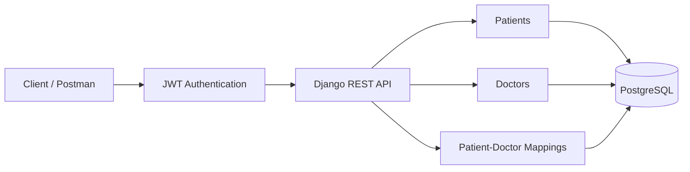

# Healthcare Backend API


A simple healthcare backend API built with **Django REST Framework** and **PostgreSQL**.

The API provides authentication and allows authenticated users to manage patients, doctors, and patient-doctor mappings.

## Features

* User registration and JWT login
* Patient CRUD operations
* Doctor CRUD operations
* Assign doctors to patients
* View doctors assigned to a patient
* Delete patient-doctor mappings
* PostgreSQL database
* Authentication for protected APIs

## Tech Stack

* Python
* Django
* Django REST Framework
* PostgreSQL
* JWT Authentication
* Django ORM

## API Workflow



## Project Structure

```text
healthcare/
├── api/
│   ├── models.py
│   ├── serializers.py
│   ├── views.py
│   └── urls.py
├── config/
│   ├── settings.py
│   └── urls.py
├── manage.py
├── requirements.txt
├── .env.example
└── .gitignore
```

## Setup

### 1. Clone the Repository

```bash
git clone https://github.com/Md-Danyal/healthcare-backend
cd healthcare
```

### 2. Create and Activate Virtual Environment

```bash
python -m venv venv
```

**Windows:**

```bash
venv\Scripts\activate
```

### 3. Install Dependencies

```bash
pip install -r requirements.txt
```

### 4. Configure Environment Variables

Create a `.env` file using `.env.example` and add your PostgreSQL database details.

### 5. Run Migrations

```bash
python manage.py migrate
```

### 6. Start the Server

```bash
python manage.py runserver
```

The API will be available at:

```text
http://127.0.0.1:8000/api/v1/
```

## Main API Endpoints

| Method         | Endpoint                 | Description          |
| -------------- | ------------------------ | -------------------- |
| POST           | `/api/v1/auth/register/` | Register user        |
| POST           | `/api/v1/auth/login/`    | Login and get JWT    |
| GET/POST       | `/api/v1/patients/`      | List/Create patients |
| GET/PUT/DELETE | `/api/v1/patients/<id>/` | Manage a patient     |
| GET/POST       | `/api/v1/doctors/`       | List/Create doctors  |
| GET/PUT/DELETE | `/api/v1/doctors/<id>/`  | Manage a doctor      |
| GET/POST       | `/api/v1/mappings/`      | List/Create mappings |
| GET/DELETE     | `/api/v1/mappings/<id>/` | View/Delete mappings |

Protected endpoints require a JWT access token:

```text
Authorization: Bearer <access_token>
```

## Testing

The APIs can be tested using **Postman** or any REST API client.
